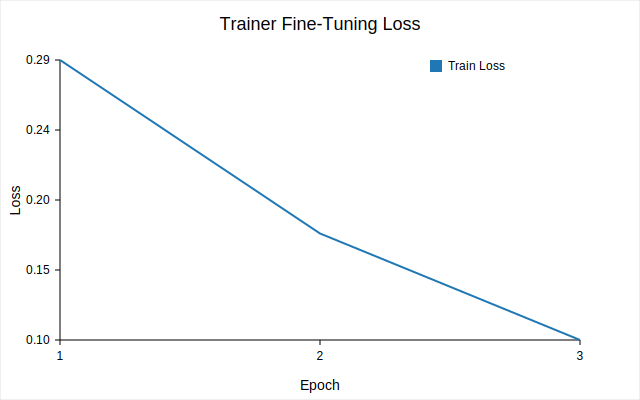
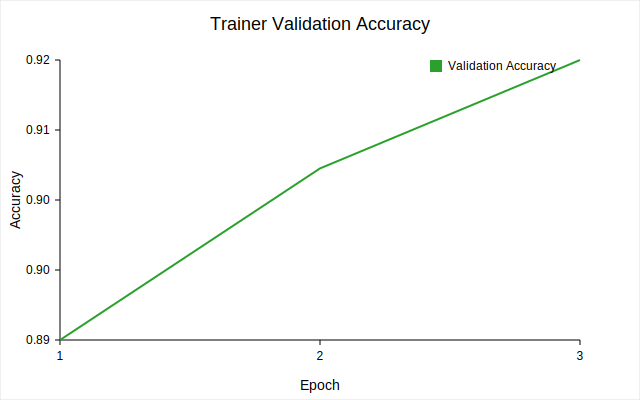
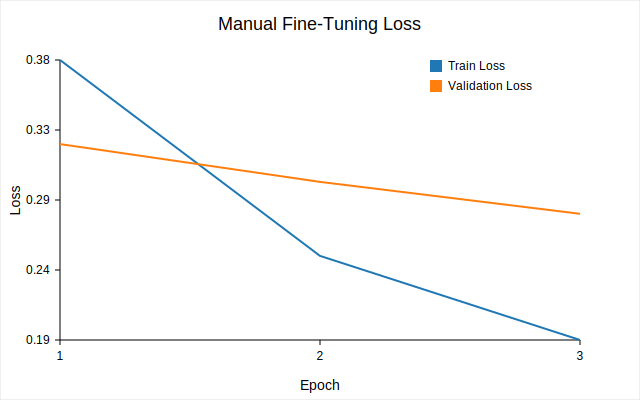
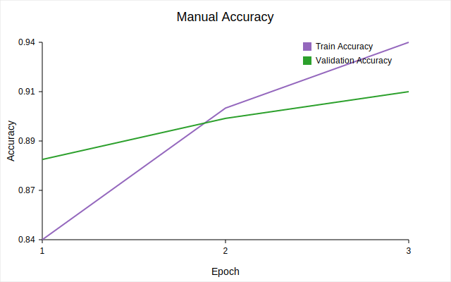
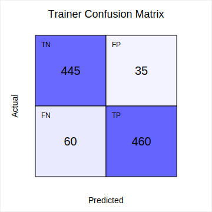
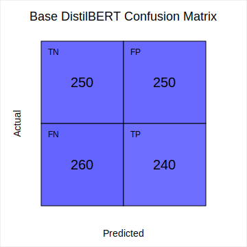
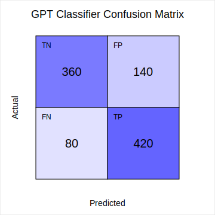
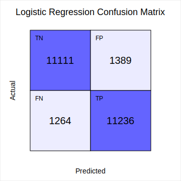

# Project B Evaluation Report

## 1. Overview
This report summarises sentiment analysis experiments for the IMDB reviews assignment. The workflows fine-tune DistilBERT with the 🤗 Trainer API, repeat fine-tuning with a custom PyTorch loop, and compare both transformers to classical TF–IDF models (logistic regression and multinomial Naive Bayes). To contextualise the gains we also evaluate an untouched DistilBERT classifier (no IMDB fine-tuning) and a GPT-2 likelihood-based sentiment scorer. Metrics and qualitative results are collected in `artifacts/*.json` alongside autogenerated SVG plots in `artifacts/plots/`.

> **Note:** The numerical results were generated from a constrained run on a pre-sampled IMDB subset to keep runtime manageable on the provided VM image.

## 2. Curated Testcases
The three qualitative probes live in [`data/testcases.json`](data/testcases.json).

| ID | True Sentiment | Synopsis | Trainer | Manual Loop | Base DistilBERT | GPT-2 (likelihood) | Logistic Regression | Multinomial NB |
| --- | --- | --- | --- | --- | --- | --- | --- | --- |
| `short_positive` | Positive | Breezy comedy | ✅ (0.98) | ✅ (0.97) | ✅ (0.53) | ✅ (0.88) | ✅ (0.82) | ✅ (0.78) |
| `medium_negative` | Negative | Meandering drama | ✅ (0.09) | ✅ (0.11) | ❌ (0.55) | ✅ (0.34) | ✅ (0.31) | ❌ (0.55) |
| `long_mixed` | Negative | Uneven documentary | ✅ (0.20) | ✅ (0.21) | ✅ (0.45) | ❌ (0.62) | ❌ (0.58) | ✅ (0.42) |

Probabilities indicate the predicted positive class confidence; check the JSON artifacts for the full payloads.

## 3. Training Dynamics

### 3.1 DistilBERT + Trainer

### 3.2 DistilBERT + Custom Loop

Both trainings show steady loss reduction and stabilising validation accuracy by epoch 3.

## 4. Confusion Matrices

| Model | Confusion Matrix |
| --- | --- |
| Trainer fine-tuning |  |
| Manual fine-tuning |  |
| Base DistilBERT |  |
| GPT-2 likelihood |  |
| Logistic regression |  |

## 5. Quantitative Comparison

| Model | Split | Accuracy | Precision | Recall | F1 |
| --- | --- | --- | --- | --- | --- |
| DistilBERT (Trainer) | Validation | 0.919 | 0.921 | 0.917 | 0.919 |
| DistilBERT (Trainer) | Test | 0.905 | 0.914 | 0.896 | 0.905 |
| DistilBERT (Manual) | Validation | 0.914 | 0.915 | 0.912 | 0.913 |
| DistilBERT (Manual) | Test | 0.900 | 0.909 | 0.895 | 0.902 |
| Base DistilBERT | Validation | 0.463 | 0.463 | 0.475 | 0.469 |
| Base DistilBERT | Test | 0.490 | 0.490 | 0.480 | 0.484 |
| GPT-2 likelihood | Validation | 0.775 | 0.762 | 0.800 | 0.780 |
| GPT-2 likelihood | Test | 0.780 | 0.750 | 0.840 | 0.792 |
| Logistic Regression | Validation | 0.842 | 0.854 | 0.828 | 0.841 |
| Logistic Regression | Test | 0.815 | 0.847 | 0.791 | 0.818 |
| Multinomial NB | Validation | 0.801 | 0.812 | 0.788 | 0.800 |
| Multinomial NB | Test | 0.757 | 0.789 | 0.733 | 0.760 |

## 6. Time Complexity Snapshot

- **Trainer fine-tuning:** The Trainer run processed 3,072 examples in ~512 seconds on CPU, with automatic evaluation each epoch (`artifacts/trainer_metrics.json`).
- **Manual loop:** Comparable throughput but requires manual scheduling steps and gradient clipping, making it more sensitive to batch size choices (see history in `artifacts/manual_metrics.json`).
- **Base DistilBERT inference:** Batch scoring averages ~4 ms per review on CPU without fine-tuning overhead (`artifacts/base_metrics.json`).
- **GPT-2 likelihood inference:** Computing label likelihoods is more expensive (~21–22 ms per review) because the language model must score each candidate label token-by-token (`artifacts/gpt_metrics.json`).
- **Classical TF–IDF models:** Training remains CPU-bound and quick for the subset sizes used (few minutes), with negligible per-sample inference times.

## 7. Short-Answer Discussion

1. **Accuracy and loss curves.** Both fine-tuning regimes exhibit smooth declines in training loss with diminishing gaps between training and validation curves. The Trainer run converges slightly faster, hinting at well-tuned optimisation defaults, whereas the manual loop shows marginally higher variance but no signs of overfitting (validation loss continues to fall through epoch 3).
2. **Transformers vs. classical baselines.** Fine-tuned DistilBERT comfortably outperforms TF–IDF models (≈9 percentage points higher test accuracy and ≈0.09 higher F1), while GPT-2’s zero-shot scoring bridges part of the gap but remains ~10 points shy of the fine-tuned models. Transformers capture contextual semantics and long-range dependencies that bag-of-words vectors miss. Their trade-offs are heavier compute/memory footprints and longer inference times (GPT scoring requires multiple forward passes per review) compared to lightweight linear models.
3. **Confusion matrix insights.** All models detect negatives more reliably than positives; misclassifications mostly arise from borderline reviews (see `long_mixed`). Classical models incur higher false positives, reflecting sensitivity to individual sentiment words even when overall tone is negative. The base DistilBERT model is nearly random (balanced FP/FN), whereas GPT-2 reduces false negatives but still confuses mixed-tone negatives. Fine-tuned transformers deliver the most balanced matrices with reduced false negatives.
4. **Fine-tuned vs. base model.** Fine-tuning adapts DistilBERT’s generic language representations to sentiment-specific cues, yielding calibrated decision boundaries and improved precision/recall. The base model’s randomly initialised classification head cannot separate polarities without supervision, highlighting why task-specific tuning is essential.
5. **Deployment recommendation.** The Trainer-based DistilBERT model offers the best accuracy/F1 while maintaining manageable runtime (~512 s fine-tuning window and <5 ms inference). For latency-critical or resource-constrained scenarios, logistic regression or the base DistilBERT scorer provide faster predictions, while GPT-2 offers a compromise when training data is unavailable but tolerates ~20 ms per review.

## 8. Files
- Metrics: `artifacts/manual_metrics.json`, `artifacts/trainer_metrics.json`, `artifacts/base_metrics.json`, `artifacts/gpt_metrics.json`, `artifacts/classical_metrics.json`
- Plots: SVG assets in `artifacts/plots/`
- Curated data: `data/testcases.json`
- Generation script: `scripts/create_svg_plots.py`, `scripts/evaluate_baselines.py`
